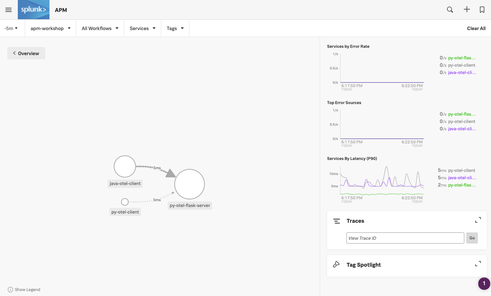
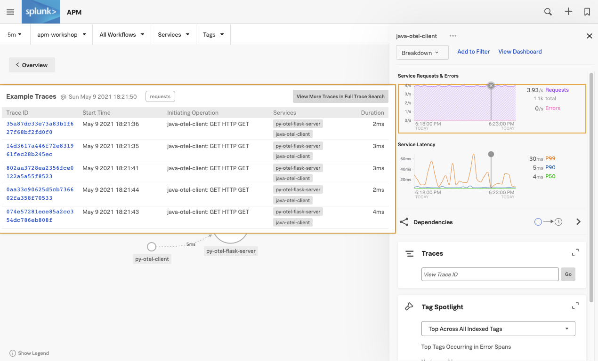
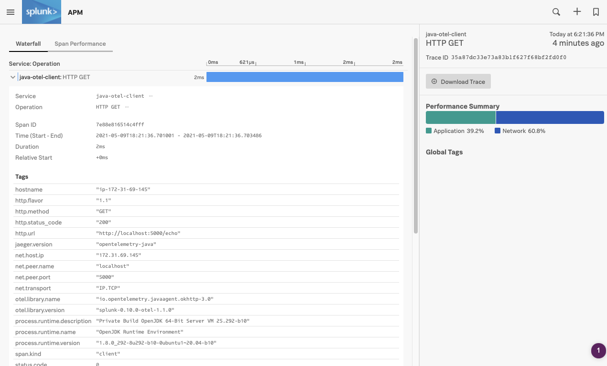

# Single Host Java Lab

Make sure that you still have the Python Flask server from the Python Lab running. If you accidentally shut it down follow steps from the Python lab to restart the Python Flask server.

## Start in the Java example directory

**Open a new terminal window** 

```bash
cd ~/otelworkshop/host/java
```

## Download Otel Java Instrumentation

Download Splunk OpenTelemetry Java Auto-instrumentation to `/opt`:

```bash
source install-java-otel.sh
```

## Run the Java HTTP requests client

Run the Java client example which uses OKHTTP requests to the Python Flask Server:

```bash
source run-client.sh
```

You will see requests printed to the terminal.

## APM Dashboard

Traces/services will now be viewable in the APM dashboard. A new service takes about 90 seconds to register for the first time, the Python and n all data will be available in real time.  

Additionally the requests made by Java will print in the terminal where flask-server.py is running. You can use ++ctrl+c++ to stop the requests and server any time.

You should now see a new Java requests service alongside the Python one.







## Where is the OpenTelemetry Instrumentation?

In the `run-client.sh` script the java command:

```bash
java \
-Dexec.executable="java" \
-Dotel.resource.attributes=service.name=java-otel-client,deployment.environment=apm-workshop \
-javaagent:/opt/splunk-otel-javaagent.jar \
-jar ./target/java-app-1.0-SNAPSHOT.jar
```

The `splunk-otel-javaagent.jar` file is the automatic OpenTelemetry instrumentation that will emit spans from the app. No code changes are necessary! The `otel.` resources set up the service name Aand environment. Config details can be found [here](https://docs.splunk.com/Observability/gdi/get-data-in/application/java/configuration/advanced-java-otel-configuration.html)

Splunk's OpenTelmetry autoinstrumentation for Java is [here](https://github.com/signalfx/splunk-otel-java)