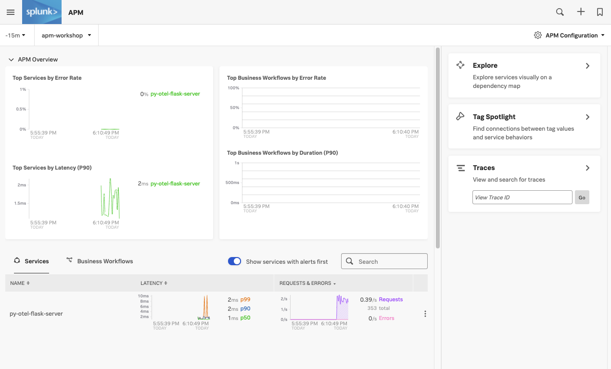
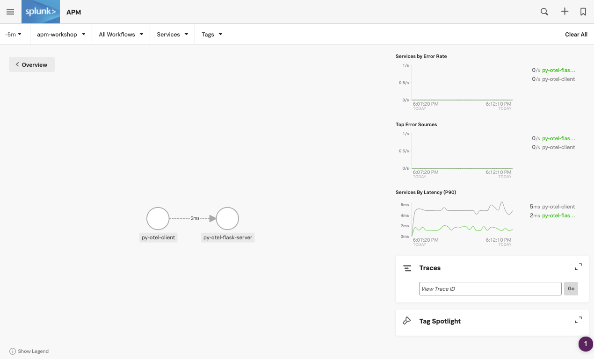
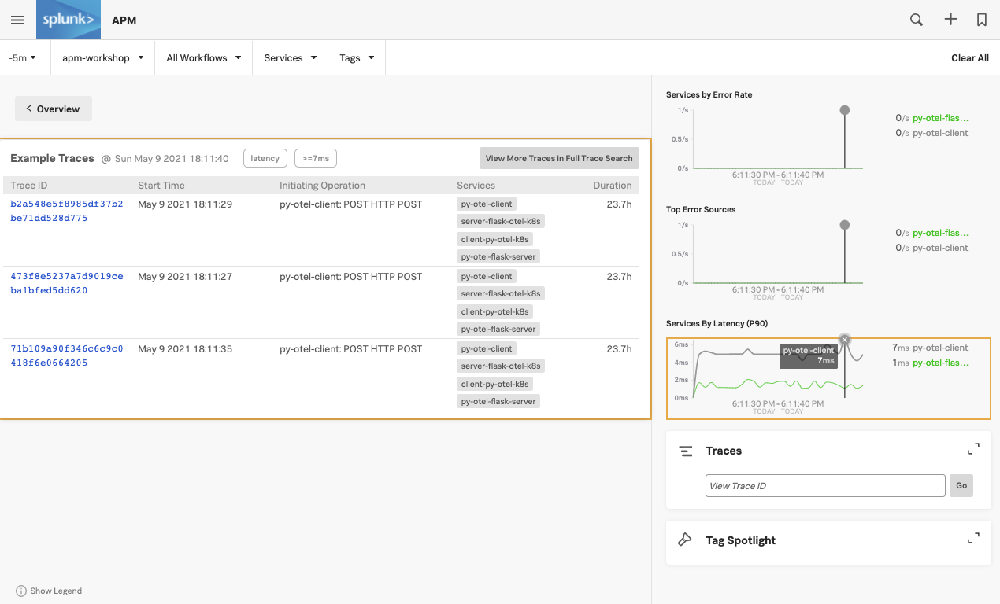
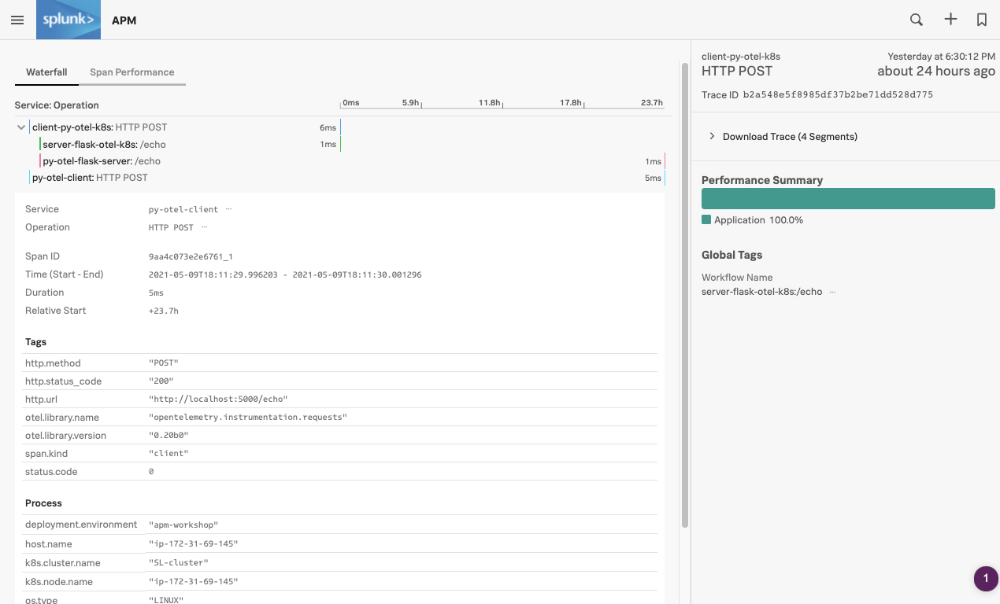

# Single Host Python Lab

Each step should be performed in a separate terminal window.

Make sure your Ubuntu environment was prepared properly as described in the **Preparation** section.  

## Configure Environment Variables for Otel and Run Python Flask Server

**Open the first terminal window** in your Linux instance and set up environment and run Python Flask server using auto-instrumentation:

```bash
cd ~/otelworkshop/host/python
source run-server.sh
```

You will see the server startup text when this is run.

## Run Python Client Application

**Open a new terminal window** in your Linux instance and run the Python client to sent POST requests to the Flask server:  

Run the client Python app via the `splunk-py-trace` command to send requests to the Flask server:  

```bash
cd ~/otelworkshop/host/python
source run-client.sh
```

The `python-requests.py` client will make calls to the flask server with a random short sleep time.  
You can stop the requests with ++ctrl+c++

## Validate span are being sent

Check OpenTelemetry Collector Statistics to see that spans are being sent. Open a new terminal window to your Linux instance.

`lynx localhost:55679/debug/tracez` will show the metrics and spans being gathered and sent by the Collector.  

Lynx is a text browser that was installed during with the `setup-tools`. Enabling a web browser to access your environment will allow for a full web GUI.  


## APM Dashboard

Traces / services will now be viewable in the APM dashboard. A new service takes about 90 seconds to register for the first time, and then all data will be available in real time.  
  
Additionally span IDs will print in the terminal where flask-server.py is running. You can use ++ctrl+c++ to stop the requests and server any time.  

Navigate to `Splunk Overvability -> APM`



Service map of this python demo  



Click on one of the peaks in the grey graph within "Services By Latency (P90)" on the right hand side and then click the trace to see spans. Also try out **Tag Spotlight** to see how application operations are broken down in a granular way. You can also try the **Tags** menu on top to search for a single trace or group of traces by key:value.

  
  

## Where is the OpenTelemetry Instrumentation?

The `run-server.sh` and `run-client.sh` scripts set up the environment variables for OpenTelemetry and invoke the Python auto instrumentation:  

`spluk-py-trace` is the auto instrumenting function that runs Python3 with the instrumentation that automatically emits spans from the Python app. No code changes are necessary. Splunk Observability Cloud has a `Data Setup` Wizard to guide through instrumentation setup.

OpenTelemetry repo for Python is [here](https://github.com/signalfx/splunk-otel-python).

!!! important
    Leave the Flask server running you'll need need this process for the next client examples in the workshop.